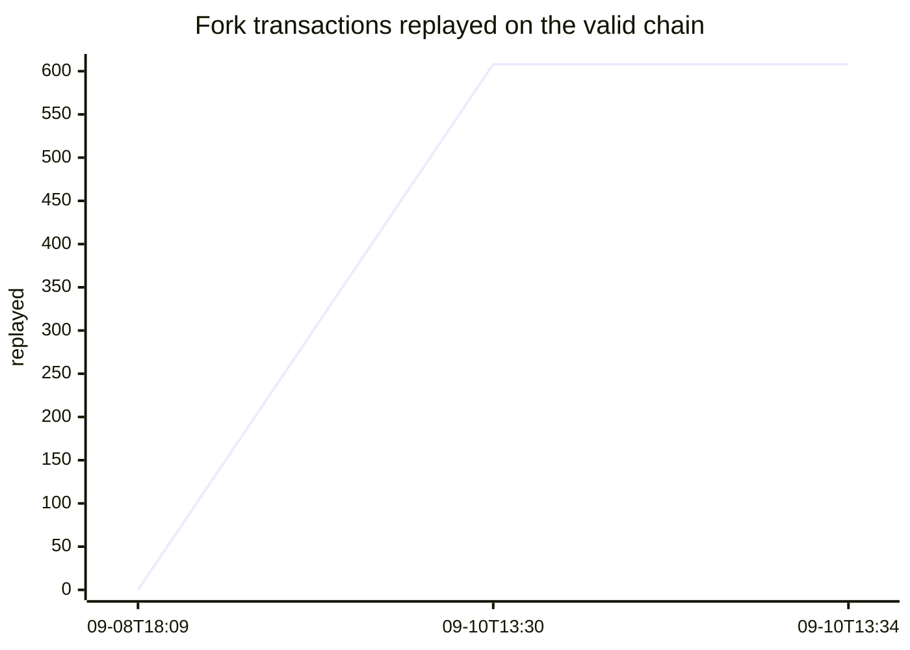
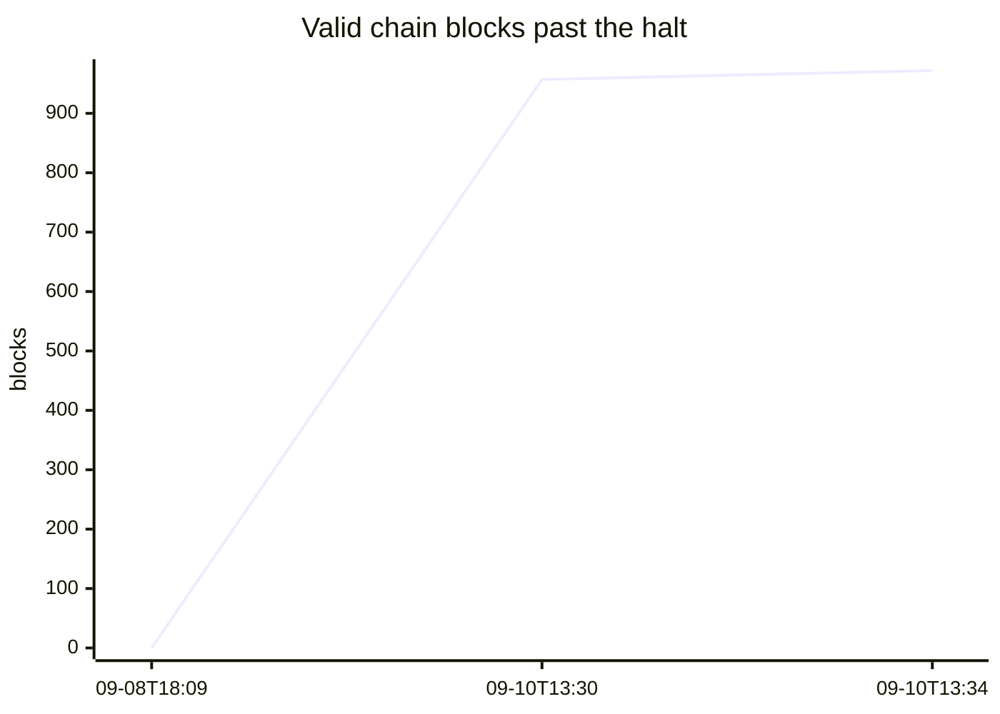

# Liquid 2026-09-06 incident: fork transaction replay sets

On 2026-09-06 an Elements range-proof verification-**cache** bug (commit `c26d719`,
which bound the cache key to asset + scriptPubKey but concatenated the fields with no
length separators) was exploited to mint L-BTC on Liquid mainnet. The chain split at
height **4,050,335**: most nodes rejected the exploit block **4,050,336** and stalled,
while a minority built an 897-block fork to **4,051,232**.

This repo lists every transaction on that abandoned fork so anyone can watch which ones
reappear ("are replayed") once the valid chain restarts, and independently reproduce the
fork to confirm these transactions exist only on the invalid chain.

- Halt / last common block: **4,050,335** `aad24e4fb64ca8adf4961667da87820cd48e553957ac64e75de7cdb298b5d66b`
- Exploit (mint) block: **4,050,336** `e1d9a2aae69e0fc3ca18f7f7f84e0615e92a5e3b5000d66c10c34043346da0d5`
- Mint tx: `f24a4b179b5cc7e88b25a763911f7cbdf2bf45d1d1b5ab611e94461cef0a183f`

<!-- MONITOR:START -->
## Live status — auto-updated

**Valid chain tip:** 4,051,307 · **972 block(s) past the halt** (4,050,335)  
**Replayed:** 608 / 608 expected · 0 / 8 tainted  
_Last change: 2026-09-10T13:34:48Z · source: mempool's liquid.network · updated hourly, committed on change._

### Recent changes

| UTC | valid tip | grown | replayed (exp / tainted) | on fork |
|---|---|---|---|---|
| 2026-09-10T13:34:48Z | 4,051,307 | 972 | 608 | False |
| 2026-09-10T13:30:06Z | 4,051,292 | 957 | 608 | False |
| 2026-09-08T18:09:06Z | 4,050,335 | 0 | 0 | False |
<!-- MONITOR:END -->

## Contents

- **`expected-replay/<txid>.hex`** — 608 legitimate transactions from the fork, one full
  raw transaction per file (hex, including witness). We **expect** most of these to be
  re-mined on the valid chain during recovery. Rebroadcastable with `sendrawtransaction`.
- **`do-not-expect-replay/<txid>.hex`** — the 8 tainted transactions: the mint and its
  spend-descendants. These move inflated L-BTC that does not exist on the valid chain, so
  they can **never** be replayed. If any appears on the valid chain, the inflation was
  accepted there.
- **`coinbase/<txid>.hex`** — the 897 per-block coinbase (fee-collection) transactions,
  one per fork block. Archived for completeness; these are not replay candidates, since
  every block mints its own coinbase.
- **`blocks/<height>-<hash>.bin`** — the raw serialized blocks: the 897 fork blocks
  (4,050,336–4,051,232) plus the valid anchor block 4,050,335. This is the primary source;
  the raw transactions above are sliced from these. Feed them to a node with `submitblock`.
- `blocks.csv` — manifest of every block file: `height,hash,time_iso,tx_count,size_bytes,sha256,chain`
  (`chain` is `fork` or `valid-anchor`). Use the sha256 column to verify integrity.
- `expected-replay.csv`, `do-not-expect-replay.csv`, `replay-sets.json` — the same tx sets
  as txid lists with fork heights (and roles for the tainted set).

Match is by **exact txid** appearing on the valid chain **above height 4,050,335**.

## Counts
| set | count |
|---|---|
| expected to replay | 608 |
| never replayable (tainted) | 8 |
| coinbase (excluded — each valid block has its own) | 897 |

## Independently reproduce the affected chain

This is the approach verified to work. **Research / archival only:** a node that does this
lands on the invalid fork and will not rejoin the real chain on its own (see the last note).

1. Build and run Elements at a commit that includes the vulnerable cache-key commit
   `c26d719` — e.g. master `c7e856fab1b0c4d37005e25c0940184d812a26a0` (reports
   `v28.99.0-c7e856fab1b0`). Sync `liquidv1` to the halt tip 4,050,335. Run it **isolated**
   (`-connect=0 -listen=0`) so it neither adopts a competing honest chain nor propagates
   the invalid fork.

2. Poison the range-proof cache by pushing block 4,050,335's primer transactions back
   through the mempool (the only path that inserts into the cache):

       elements-cli invalidateblock aad24e4fb64ca8adf4961667da87820cd48e553957ac64e75de7cdb298b5d66b

   This rewinds to 4,050,334 and re-admits 4,050,335's transactions to the mempool.

3. Reconnect:

       elements-cli reconsiderblock aad24e4fb64ca8adf4961667da87820cd48e553957ac64e75de7cdb298b5d66b

   Block 4,050,336's mint output now computes the same cache key as a primer output,
   hits the poisoned entry, skips `secp256k1_rangeproof_verify`, and is accepted. The node
   reorgs onto the fork.

4. On an isolated node (no peers to serve block bodies), feed the fork forward yourself.
   The raw blocks are large; the raw transactions in this repo are also enough to rebuild
   the tainted history. If you have the block bodies, `submitblock` heights
   4,050,337 … 4,051,232 in order, and start with `-validatepegin=0` (peg-in mainchain
   re-checks otherwise block forward progress; this does not change the resulting
   chainstate).

**Why this proves the point:** the *same binary* on a cold cache (an ordinary from-disk
sync) rejects 4,050,336 with `mandatory-script-verify-flag-failed, Range proof verification
failed`. Acceptance requires the poisoned cache entry, which only mempool acceptance
(store=true) inserts; block connection never does. So these transactions live only on an
invalid chain, and the `do-not-expect-replay/` set can never be valid on the real chain.

**Getting back:** once on the fork (tip 4,051,232, the most-work chain) a node will not
switch back automatically. To rejoin, `invalidateblock 4050336` to drop to 4,050,335, or
reindex — and even then only once a restarted honest chain out-works the fork.

## Automated monitor (GitHub Action)

`.github/workflows/monitor.yml` runs `monitor/check.py` hourly against mempool's
liquid.network Esplora and records the valid chain's state:

- `monitor/status.json` — current tip height/hash, blocks grown past the halt, how many
  of each set have been replayed, and two alert flags: `fork_adopted_ALERT` (liquid.network
  reorged onto the fork) and `tainted_replayed_ALERT` (an inflated tx appeared on the valid
  chain — should never happen).
- `monitor/tips-history.csv` — one row each time the state changes.

It only queries liquid.network (mempool's instance), does the expensive per-block replay
scan only once the chain advances past 4,050,335 on a non-fork chain, and commits back only
on change, so history stays clean. Enable Actions on the repo and allow workflow write
access (Settings → Actions → General → Workflow permissions → Read and write). Scheduled
runs are best-effort and GitHub pauses schedules after 60 days without a commit.

## Monitor for replay

For each `<txid>.hex`, the filename is the txid. Against a node with `-txindex` on the
valid chain:

    elements-cli getrawtransaction <txid> true

Treat it as replayed if it returns and its confirming block height is **> 4,050,335**. Or
scan valid blocks above the halt height and match txids. To help a transaction along, the
raw hex is provided: `elements-cli sendrawtransaction "$(cat expected-replay/<txid>.hex)"`.

## Caveats

- Exact-txid only: a transaction re-signed with a different fee gets a new txid and will
  not match, even if economically equivalent.
- "Expected" is not a guarantee: a user may never rebroadcast, or a conflict may prevent
  re-mining. The list is what to watch, not a prediction each will appear.
- Fork data source: an Esplora raw-block archive of heights 4,050,336–4,051,232; each raw
  transaction was sliced from its block and its txid round-trip verified.
